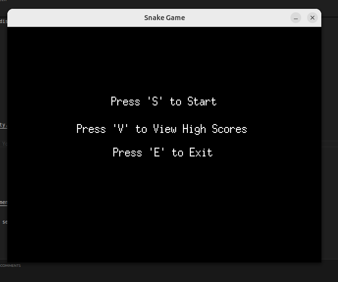
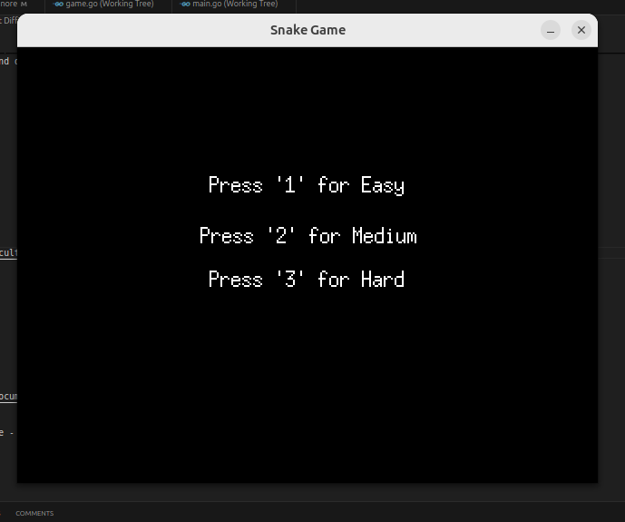
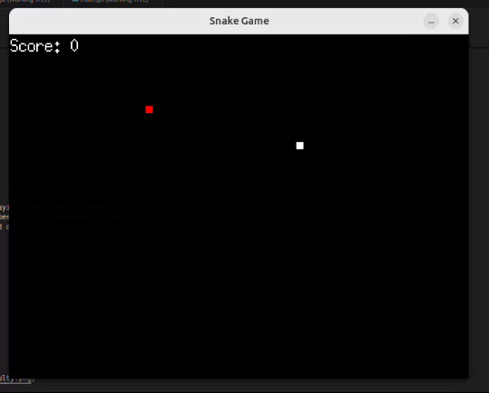
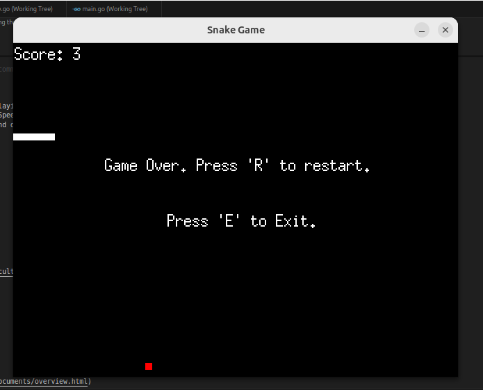
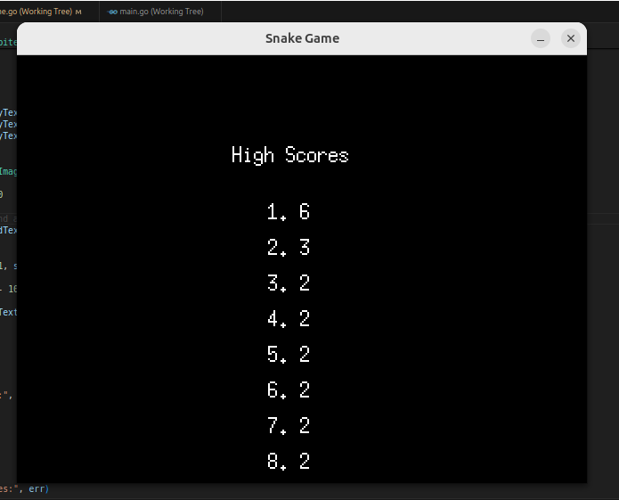

# Snake Game

## Author
Amine EL AMRANI & Ayoub ECH-CHETYOUY & Mouad OUCHERIF

## Institution
École d'Ingénieurs Généraliste du Numérique - EFREI

## Abstract
SNAKE, a simple yet captivating video game, has marked an entire generation of players. This game has surpassed its status as a mere video game to become a cultural icon, evoking childhood memories and moments of sharing. Its simplicity, addictive nature, and lasting influence on popular culture make it an interesting subject of study for video game and popular culture researchers.

## Contents
1. [Introduction](#introduction)
2. [Project Details](#project-details)
3. [How to Run](#how-to-run)
4. [Functionalities](#functionalities)
5. [Screenshots](#screenshots)
6. [Documentation](#documentation)

## Introduction
This project is a Snake game developed in Go using the Ebiten game library. The player controls a snake to collect food items to grow longer. The game ends when the snake collides with the wall or itself.

## Project Details
- **Game Title**: Snake Game
- **Programming Language**: Go
- **Game Library**: Ebiten

## How to Run
### Prerequisites
- Install Go: [Go installation guide](https://golang.org/doc/install)
- Install Ebiten: Run `go get -u github.com/hajimehoshi/ebiten/v2`

### Running the Game
1. Clone the repository:
    ```sh
    git clone https://github.com/amine-el-amrani/GoSnake.git
    cd GoSnake
    ```

2. Run the game:
    ```sh
    go run .
    ```

### Building the Game
1. Build the executable:
    ```sh
    go build -o snake-game
    ```

2. Run the executable:
    ```sh
    ./snake-game
    ```

## Functionalities
- **Game States**: Menu, Select Difficulty, Playing, Game Over, Scoreboard.
- **Difficulty Levels**: Easy, Medium, Hard. Speed varies based on difficulty.
- **Score Tracking**: High scores are saved and displayed.
- **Controls**:
  - `S`: Start the game
  - `V`: View high scores
  - `E`: Exit the game
  - `1`: Easy difficulty
  - `2`: Medium difficulty
  - `3`: Hard difficulty
  - Arrow keys: Control the snake
  - `R`: Restart the game after game over
- **Sound Effects**:
  - Sound when eating food.
  - Sound when losing the game.
  - Background music during gameplay.

## Screenshots
### Main Menu


### Select Difficulty


### Game Screen


### Game Over


### Scoreboard


## Documentation
- [Ebiten Documentation](https://ebiten.org/documents/overview.html)
